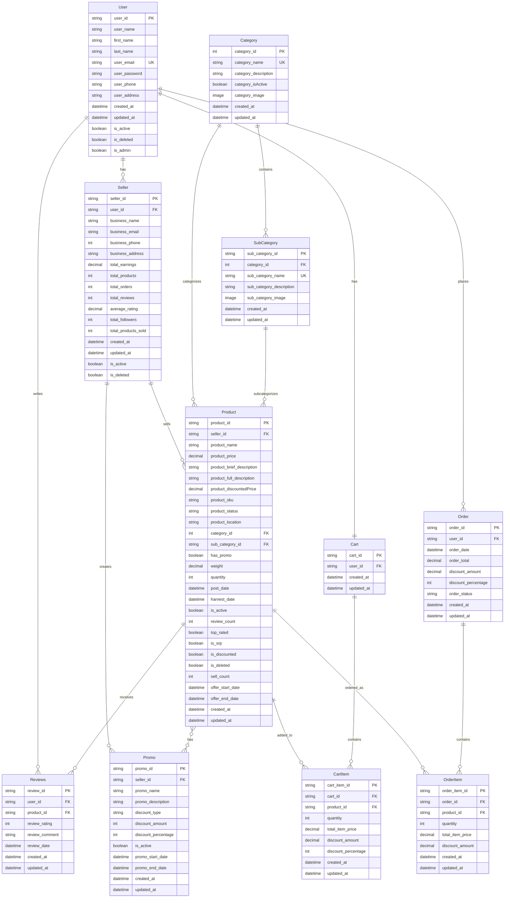

# FreshBytes API - Entity Relationship Diagram (ERD) Analysis

## Current Database Schema



## Current Architecture Assessment

### ✅ **Strengths**
1. **Clear Entity Relationships**: Well-defined foreign key relationships
2. **Custom ID Generation**: Meaningful prefixes for all entities
3. **Comprehensive Product Management**: Status tracking, pricing, categories
4. **Promo System**: Many-to-many relationship with products
5. **Review System**: User-product relationship for ratings
6. **Cart & Order Flow**: Complete e-commerce workflow

### ⚠️ **Issues & Missing Components**

## **CRITICAL IMPROVEMENTS NEEDED**

### 1. **Security & Authentication**
```python
# Missing: User Authentication Model
class UserProfile(models.Model):
    user = models.OneToOneField(User, on_delete=models.CASCADE)
    profile_picture = models.ImageField(upload_to='profile_pics/', null=True, blank=True)
    date_of_birth = models.DateField(null=True, blank=True)
    gender = models.CharField(max_length=10, choices=GENDER_CHOICES, null=True)
    email_verified = models.BooleanField(default=False)
    phone_verified = models.BooleanField(default=False)
    last_login = models.DateTimeField(null=True)
```

### 2. **Payment System**
```python
# Missing: Payment Processing
class Payment(models.Model):
    payment_id = models.CharField(primary_key=True, max_length=12, unique=True, editable=False)
    order_id = models.ForeignKey(Order, on_delete=models.CASCADE)
    payment_method = models.CharField(max_length=50, choices=PAYMENT_METHODS)
    payment_status = models.CharField(max_length=50, choices=PAYMENT_STATUS)
    amount = models.DecimalField(max_digits=10, decimal_places=2)
    transaction_id = models.CharField(max_length=255, null=True)
    payment_date = models.DateTimeField(auto_now_add=True)
    created_at = models.DateTimeField(auto_now_add=True)
    updated_at = models.DateTimeField(auto_now=True)
```

### 3. **Inventory Management**
```python
# Missing: Stock Tracking
class Inventory(models.Model):
    inventory_id = models.CharField(primary_key=True, max_length=12, unique=True, editable=False)
    product_id = models.OneToOneField(Product, on_delete=models.CASCADE)
    current_stock = models.IntegerField(default=0)
    reserved_stock = models.IntegerField(default=0)
    available_stock = models.IntegerField(default=0)
    low_stock_threshold = models.IntegerField(default=10)
    last_restocked = models.DateTimeField(null=True)
    created_at = models.DateTimeField(auto_now_add=True)
    updated_at = models.DateTimeField(auto_now=True)
```

### 4. **Shipping & Delivery**
```python
# Missing: Shipping Information
class ShippingAddress(models.Model):
    address_id = models.CharField(primary_key=True, max_length=12, unique=True, editable=False)
    user_id = models.ForeignKey(User, on_delete=models.CASCADE)
    address_type = models.CharField(max_length=20, choices=ADDRESS_TYPES)
    recipient_name = models.CharField(max_length=255)
    phone_number = models.CharField(max_length=20)
    address_line1 = models.CharField(max_length=255)
    address_line2 = models.CharField(max_length=255, null=True, blank=True)
    city = models.CharField(max_length=100)
    state = models.CharField(max_length=100)
    postal_code = models.CharField(max_length=20)
    country = models.CharField(max_length=100)
    is_default = models.BooleanField(default=False)
    created_at = models.DateTimeField(auto_now_add=True)
    updated_at = models.DateTimeField(auto_now=True)

class Shipping(models.Model):
    shipping_id = models.CharField(primary_key=True, max_length=12, unique=True, editable=False)
    order_id = models.OneToOneField(Order, on_delete=models.CASCADE)
    shipping_address = models.ForeignKey(ShippingAddress, on_delete=models.CASCADE)
    shipping_method = models.CharField(max_length=50, choices=SHIPPING_METHODS)
    shipping_cost = models.DecimalField(max_digits=10, decimal_places=2)
    tracking_number = models.CharField(max_length=255, null=True)
    estimated_delivery = models.DateTimeField(null=True)
    actual_delivery = models.DateTimeField(null=True)
    shipping_status = models.CharField(max_length=50, choices=SHIPPING_STATUS)
    created_at = models.DateTimeField(auto_now_add=True)
    updated_at = models.DateTimeField(auto_now=True)
```

### 5. **Notification System**
```python
# Missing: User Notifications
class Notification(models.Model):
    notification_id = models.CharField(primary_key=True, max_length=12, unique=True, editable=False)
    user_id = models.ForeignKey(User, on_delete=models.CASCADE)
    notification_type = models.CharField(max_length=50, choices=NOTIFICATION_TYPES)
    title = models.CharField(max_length=255)
    message = models.TextField()
    is_read = models.BooleanField(default=False)
    related_object_id = models.CharField(max_length=50, null=True)
    related_object_type = models.CharField(max_length=50, null=True)
    created_at = models.DateTimeField(auto_now_add=True)
```

### 6. **Wishlist System**
```python
# Missing: User Wishlists
class Wishlist(models.Model):
    wishlist_id = models.CharField(primary_key=True, max_length=12, unique=True, editable=False)
    user_id = models.ForeignKey(User, on_delete=models.CASCADE)
    product_id = models.ForeignKey(Product, on_delete=models.CASCADE)
    added_date = models.DateTimeField(auto_now_add=True)
    
    class Meta:
        unique_together = ['user_id', 'product_id']
```

### 7. **Order History & Tracking**
```python
# Missing: Order Status History
class OrderStatusHistory(models.Model):
    history_id = models.CharField(primary_key=True, max_length=12, unique=True, editable=False)
    order_id = models.ForeignKey(Order, on_delete=models.CASCADE)
    status = models.CharField(max_length=50, choices=OrderStatus.choices)
    status_date = models.DateTimeField(auto_now_add=True)
    notes = models.TextField(null=True, blank=True)
    updated_by = models.ForeignKey(User, on_delete=models.SET_NULL, null=True)
```

## **OPTIMIZATION RECOMMENDATIONS**

### 1. **Database Indexing**
```python
# Add to models for better query performance
class Meta:
    indexes = [
        models.Index(fields=['user_email']),
        models.Index(fields=['product_status']),
        models.Index(fields=['order_status']),
        models.Index(fields=['created_at']),
    ]
```

### 2. **Caching Strategy**
```python
# Add Redis caching for frequently accessed data
from django.core.cache import cache

def get_product_with_cache(product_id):
    cache_key = f"product_{product_id}"
    product = cache.get(cache_key)
    if not product:
        product = Product.objects.get(product_id=product_id)
        cache.set(cache_key, product, 3600)  # Cache for 1 hour
    return product
```

### 3. **API Rate Limiting**
```python
# Add rate limiting to prevent abuse
from rest_framework.throttling import UserRateThrottle

class ProductRateThrottle(UserRateThrottle):
    rate = '100/hour'
```

### 4. **Data Validation**
```python
# Add comprehensive validation
from django.core.validators import MinValueValidator, MaxValueValidator

class Reviews(models.Model):
    review_rating = models.IntegerField(
        validators=[MinValueValidator(1), MaxValueValidator(5)],
        default=0
    )
```

## **IMPLEMENTATION PRIORITY**

### **High Priority (Critical for Production)**
1. ✅ User Authentication & Security
2. ✅ Payment Processing System
3. ✅ Inventory Management
4. ✅ Input Validation & Sanitization

### **Medium Priority (Important for UX)**
1. ✅ Shipping & Delivery System
2. ✅ Notification System
3. ✅ Order Status Tracking
4. ✅ Wishlist Functionality

### **Low Priority (Nice to Have)**
1. ✅ Advanced Analytics
2. ✅ Recommendation Engine
3. ✅ Social Features
4. ✅ Advanced Search & Filtering

## **PERFORMANCE OPTIMIZATIONS**

### 1. **Query Optimization**
```python
# Use select_related and prefetch_related
products = Product.objects.select_related(
    'seller_id', 'category_id', 'sub_category_id'
).prefetch_related('reviews_set', 'promos')
```

### 2. **Pagination**
```python
# Add pagination to list views
from rest_framework.pagination import PageNumberPagination

class StandardResultsSetPagination(PageNumberPagination):
    page_size = 20
    page_size_query_param = 'page_size'
    max_page_size = 100
```

### 3. **Background Tasks**
```python
# Use Celery for heavy operations
from celery import shared_task

@shared_task
def update_seller_metrics(seller_id):
    # Update seller statistics in background
    pass
```

This comprehensive analysis provides a roadmap for transforming your current API into a production-ready e-commerce platform. 