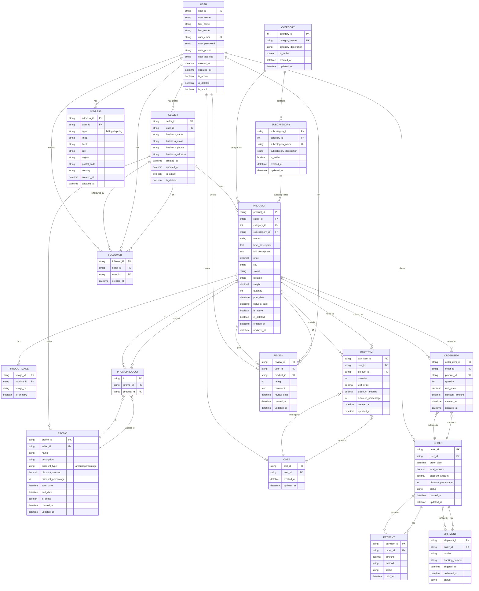

# FreshBytes Entity Relationship Diagram (ERD)

This file contains the Mermaid ERD diagram representing the data model for the FreshBytes API. For more details on the data model and relationships, see the project documentation and `ERD_Analysis.md`.

