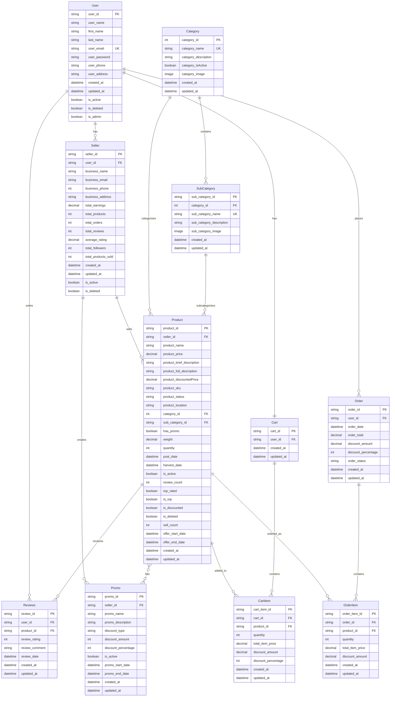
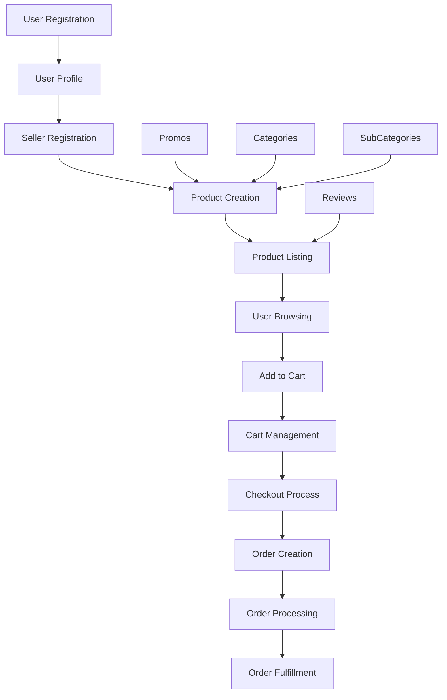

# FreshBytes API - Visual ERD

## Current Database Schema

## Key Relationships Summary

| Entity | Relationship | Related Entity | Type |
|--------|-------------|----------------|------|
| User | has | Seller | One-to-Many |
| User | writes | Reviews | One-to-Many |
| User | has | Cart | One-to-One |
| User | places | Order | One-to-Many |
| Seller | sells | Product | One-to-Many |
| Seller | creates | Promo | One-to-Many |
| Category | contains | SubCategory | One-to-Many |
| Category | categorizes | Product | One-to-Many |
| SubCategory | subcategorizes | Product | One-to-Many |
| Product | receives | Reviews | One-to-Many |
| Product | has | Promo | Many-to-Many |
| Product | added_to | CartItem | One-to-Many |
| Product | ordered_as | OrderItem | One-to-Many |
| Cart | contains | CartItem | One-to-Many |
| Order | contains | OrderItem | One-to-Many |

## Data Flow Architecture

## Current System Strengths

✅ **Well-Structured Relationships**
- Clear foreign key relationships
- Proper normalization
- Logical entity separation

✅ **E-commerce Core Features**
- Complete product management
- Shopping cart functionality
- Order processing system
- Review and rating system
- Promotional system

✅ **Data Integrity**
- Custom ID generation
- Timestamp tracking
- Soft delete capabilities
- Status tracking

## Critical Missing Components

❌ **Security & Authentication**
- No user authentication system
- Passwords stored in plain text
- No role-based access control

❌ **Payment Processing**
- No payment model
- No transaction tracking
- No payment status management

❌ **Inventory Management**
- No stock tracking
- No inventory alerts
- No stock reservation system

❌ **Shipping & Delivery**
- No shipping address management
- No delivery tracking
- No shipping cost calculation

❌ **Business Logic**
- No order total calculation
- No inventory validation
- No payment verification
- No order status transitions 